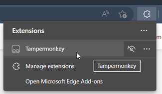
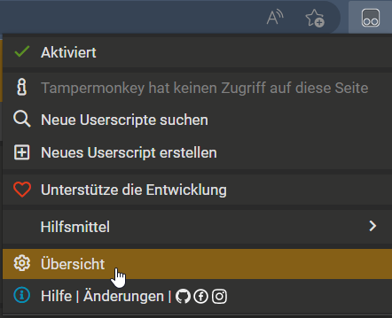
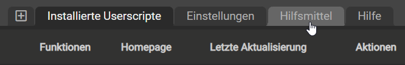
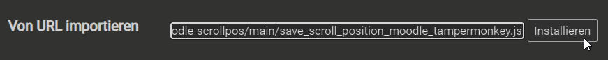

# moodle-scrollpos
JS-Skript für Tampermonkey um in Moodle-Kursen (im Boost Design) die Scroll-Position zu speichern und wiederherzustellen.

## Installationsanleitung
1. Tampermonkey Erweiterung installieren ([Chrome](https://chrome.google.com/webstore/detail/tampermonkey/dhdgffkkebhmkfjojejmpbldmpobfkfo), [Edge](https://microsoftedge.microsoft.com/addons/detail/tampermonkey/iikmkjmpaadaobahmlepeloendndfphd?hl=de-DE&gl=CH), [Firefox](https://addons.mozilla.org/de/firefox/addon/tampermonkey/)).<br>
**Hinweis:** Tampermonkey ist eine Erweiterung, die auf Websiten eigene Skripte ausführt. Dies kann auch bösartig genutzt werden, es sollten nur Skripts aus vertrauenswürdigen Quellen installiert werden! Das Skript, von dem hier die Rede ist, wird nur auf der URL `https://moodle.bbbaden.ch/course/view.php*`] ausgeführt. Das `*` steht dabei für beliebe und beliebig häufige Zahlen, Buchstaben oder Zeichen, wie z.B. `?id=42` beim Kurs mit Kurs-ID 42.
2. Erweiterung anwählen (im Browser oben rechts, je nach Browser sieht es ein bisschen anderst aus, hier als Beispiel Edge), `Tampermonkey` anklicken:<br>
3. Dann im Tampermonkey Menu `Übersicht` auswählen:<br>
4. Den Tab `Hilfsmittel` auswählen:<br>
5. Diesen Link bei "Von URL importieren" und `Installieren` wählen:<br><br>
  ````txt
https://raw.githubusercontent.com/BBBelektronik/moodle-scrollpos/main/save_scroll_position_moodle_tampermonkey.js
  ````
6. Wenn das in etwa so aussieht wie auf dem Bild unten auf `Installieren` drücken:<br>
7. Auf Moodle gehen und ausprobieren 😊 Wenn alles geklappt hat, sollte nun in jedem Moodle-Kurs die Scroll-Position bei einem neuen Laden der Seite wiederhergestellt werden.

## Limitations
Das Skript wurde erfolgreich getestet in
* **Firefox** `113.0.1 (64-bit)`
* **Vivaldi** `6.0.2979.18 (Stable channel) (64-bit)`
* **Microsoft Edge** `113.0.1774.42 (Official build) (64-bit)`

Es sollte allerdings auch in allen anderen Browsern (wie z.B. Google Chrome), die über die Tampermonkey Erweiterung verfügen, funktionieren.